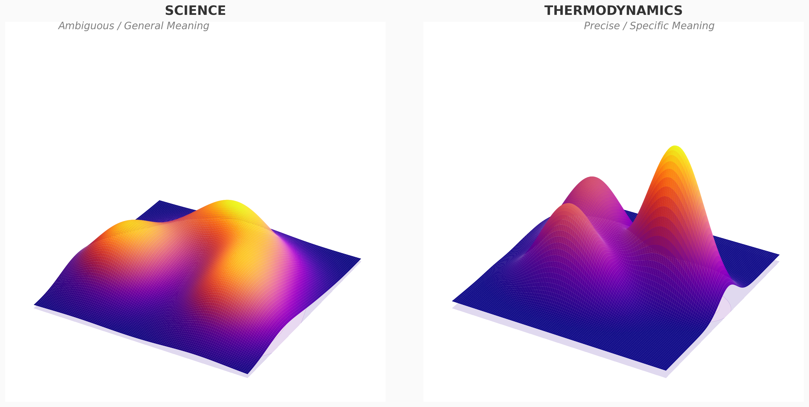
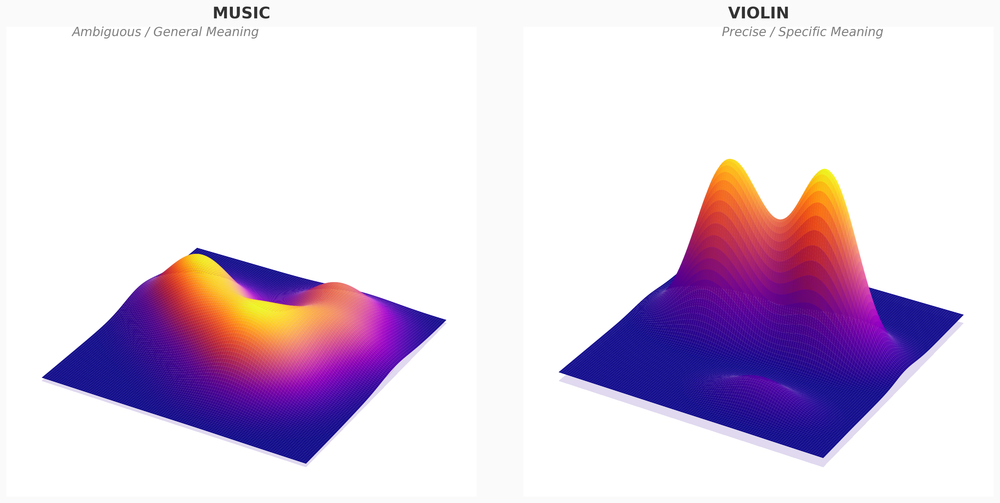
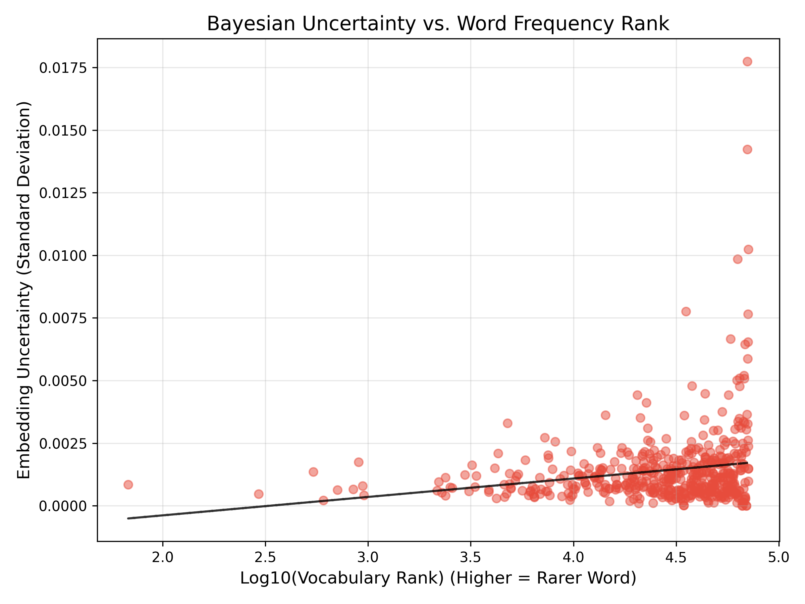
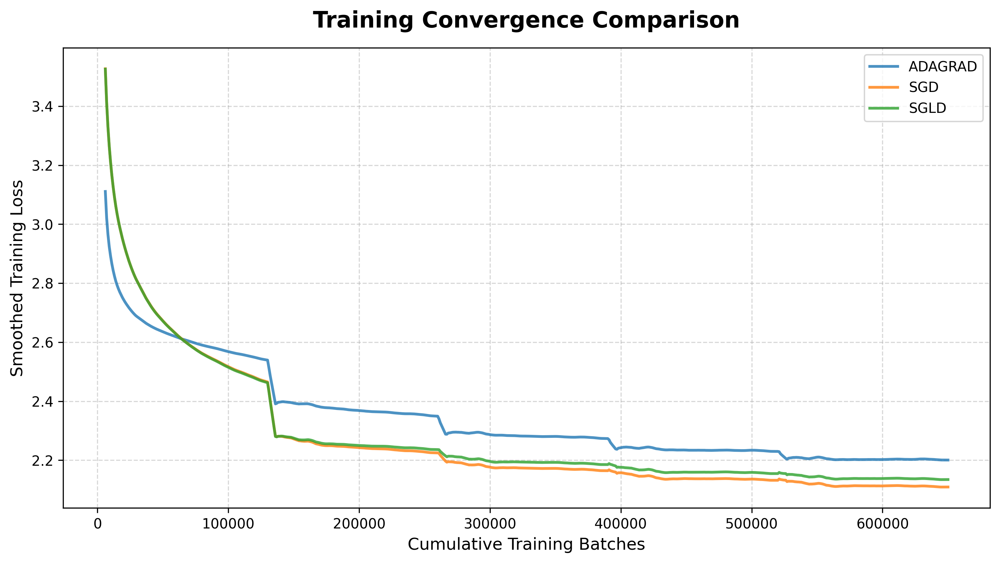
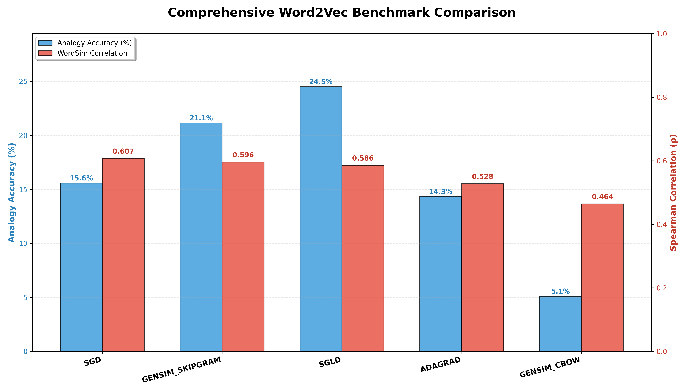
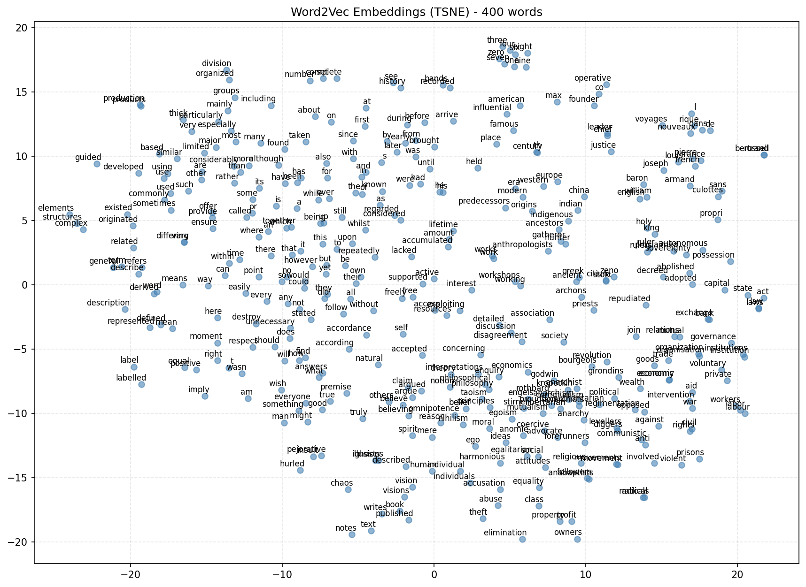

# Word2Vec: Skip-Gram with SGLD in NumPy

## Overview
This repository contains a full implementation of the **Word2Vec (Skip-Gram with Negative Sampling)** training loop written from scratch in **NumPy** (no PyTorch, TensorFlow, or other ML frameworks). 

This project extends the standard architecture by utilizing a variation of **Bayesian Word Embeddings** via **Stochastic Gradient Langevin Dynamics (SGLD)**.

The primary goals of this project are:
1. **Mathematical Understanding**: Deriving and implementing the objective functions, probability distributions, and gradients manually.
2. **Deep Optimization**: Exploring how different optimizers (SGD, AdaGrad, and SGLD) handle the extreme variance in natural language frequency (Zipf's law) and the geometric topography of word representations.
3. **Semantic Uncertainty**: Using Langevin Dynamics to sample from the posterior distribution, capturing not just a *point estimate* of a word's meaning, but the scale of its semantic ambiguity (flat vs. steep minima).

## 1. Skip-Gram Architecture and Negative Sampling

The Skip-Gram model is tasked with predicting the context words surrounding a given center word. For each pair of a center word $c$ and a context word $ctx$, we learn embedding vectors $v_c$ and $v_{ctx}$ respectively.

To avoid the enormous computational cost of computing the full softmax denominator over the entire vocabulary $V$, we use **Negative Sampling**. With that approach, the task becomes a binary classification problem: distinguishing the true context word from $K$ artificially generated "noise" (negative) words.

The objective function to maximize for a single center-context pair is:

$$
J(\theta) = \log \sigma(v_{ctx}^T v_c) + \sum_{k=1}^K \mathbb{E}_{neg_k \sim P_n(w)} \left[ \log \sigma(-v_{neg_k}^T v_c) \right]
$$

Where $\sigma(x) = \frac{1}{1 + e^{-x}}$ is the sigmoid activation function. 

Consequently, the **Loss Function** (negative log-likelihood) that we are to minimize is:

$$
\mathcal{L} = -\log \sigma(v_{ctx}^T v_c) - \sum_{k=1}^K \log \sigma(-v_{neg_k}^T v_c)
$$

### Weight Initialization
Unlike the original Word2Vec C-code which uses a very narrow uniform initialization ($[-0.5/d, 0.5/d]$), we initialize the center word embeddings ($W_{in}$) using **Xavier Normal** initialization ($V \sim \mathcal{N}(0, 1/\sqrt{d})$). The context and negative embeddings ($W_{out}$) begin as zeros. This approach provides a mathematically sound variance scale, significantly improving the initial stability of gradients and convergence.

## 2. Data Processing

### Subsampling of Frequent Words
According to Zipf's Law, the frequency of words in natural language follows a specific distribution - a small number of words occur very frequently, while a large number of words occur very rarely.
In natural language, extremely frequent words (like "the", "a", "of") provide little semantic value. We discard them from the training stream based on their relative frequency. While the original paper suggests a simpler formula, we implement the exact empirical formula used in Mikolov's official C-code release:

$$
P_{keep}(w_i) = \left( \sqrt{\frac{f(w_i)}{t}} + 1 \right) \cdot \frac{t}{f(w_i)}
$$

$$
P_{discard}(w_i) = \max(0, 1 - P_{keep}(w_i))
$$

Where $f(w_i)$ is the word's corpus frequency and $t$ is a given threshold (e.g., $10^{-5}$). This radically speeds up training and forces the model to learn rare, meaningful representations faster.

### The Negative Distribution ($3/4$ Power Rule)
When drawing negative words $neg_k \in V$, we don't sample uniformly. Instead, we elevate the unigram frequency distribution $U(w)$ to the power of $\frac{3}{4}$:

$$
P_n(w_i) = \frac{U(w_i)^{3/4}}{\sum_{j=1}^{|V|} U(w_j)^{3/4}}
$$

This specific heuristic artificially boosts the probability of drawing rare words as negative samples, ensuring the model doesn't over-optimize against frequent terms exclusively. Moreover, we are aware that there is a possibility of drawing a word that is semantically close to the center word as a negative sample, but the damage of such an event is negligible.

### Dynamic Window Size
To give appropriately higher weight to context words that are physically closer to the center word in the sentence, we implement a dynamic window strategy. Instead of always using a fixed `window_size`, for each center word during training, the effective window size is sampled uniformly from `[1, window_size]`. This acts as a weighting mechanism, naturally ensuring that immediate neighbors are trained more frequently than distant ones.

## 3. Mathematical Gradient Derivations

Since this implementation strictly avoids autograd mechanics, we explicitly compute the partial derivatives of our Loss function $\mathcal{L}$.

First, let the dot product for the target context word be $z = v_{ctx}^T v_c$, and for the $k$-th negative sample be $z_k = v_{neg_k}^T v_c$.
Intuitively, the dot product of the center word and the context word should be large (dot product of two similar vectors is large), and the dot product of the center word and the negative samples should be small.
The core property of the sigmoid function $\sigma(x) = \frac{1}{1 + e^{-x}}$ is its elegant derivative:

$$
\sigma'(x) = \sigma(x)(1 - \sigma(x))
$$

When differentiating the log-sigmoid $\log \sigma(x)$, this simplifies further:

$$
\frac{d}{dx} \log \sigma(x) = \frac{1}{\sigma(x)} \sigma(x)(1 - \sigma(x)) = 1 - \sigma(x)
$$

Similarly, for the negative samples, we use the property $\sigma(-x) = 1 - \sigma(x)$:

$$
\frac{d}{dx} \log \sigma(-x) = \frac{1}{\sigma(-x)} \cdot \sigma(-x)(1 - \sigma(-x)) \cdot (-1) = -(1 - \sigma(-x)) = -\sigma(x)
$$

Now, recall the total negative log-likelihood $\mathcal{L}$ for a single sample:

$$
\mathcal{L} = -\log \sigma(v_{ctx}^T v_c) - \sum_{k=1}^K \log \sigma(-v_{neg_k}^T v_c)
$$

### 1. Gradient with respect to the context word vector ($v_{ctx}$)
Taking the partial derivative of $\mathcal{L}$ with respect to $v_{ctx}$ affects only the first term:

$$
\frac{\partial \mathcal{L}}{\partial v_{ctx}} = - (1 - \sigma(z)) \cdot \frac{\partial z}{\partial v_{ctx}} = (\sigma(z) - 1) \cdot v_c
$$

### 2. Gradient with respect to a negative word vector ($v_{neg_k}$)
Similarly, differentiating with respect to the $k$-th negative sample $v_{neg_k}$ isolates its corresponding term in the summation:

$$
\frac{\partial \mathcal{L}}{\partial v_{neg_k}} = - (-\sigma(z_k)) \cdot \frac{\partial z_k}{\partial v_{neg_k}} = \sigma(z_k) \cdot v_c
$$

### 3. Gradient with respect to the center word vector ($v_c$)
The center word vector $v_c$ interacts with both the positive context word and all $K$ negative samples. Applying the chain rule to the entire sum yields:

$$
\frac{\partial \mathcal{L}}{\partial v_{c}} = - (1 - \sigma(z)) \cdot v_{ctx} - \sum_{k=1}^K (-\sigma(z_k)) \cdot v_{neg_k}
$$

$$
\frac{\partial \mathcal{L}}{\partial v_{c}} = (\sigma(z) - 1) \cdot v_{ctx} + \sum_{k=1}^K \sigma(z_k) \cdot v_{neg_k}
$$

These mathematically exact formulas are implemented efficiently via tensor operations (i.e. `np.einsum` which enables us to multiply 2 matrices with incompatible shapes) in the `Model.backward_pass()` method. Numerical gradient checks ensure that the mathematical formulas perfectly match the numeric approximations.

## 4. Optimization

Training Word2Vec accurately requires managing intense scale disparities. There are two entirely different dimensions of "landscape" at play here:

### SGD & AdaGrad (Managing Frequency)
Thanks to Zipf's law, **frequent words** experience a massive number of updates. In the global optimization landscape, they accumulate huge gradients, effectively sitting in "steep valleys", while **rare words** receive very few updates (flat, low-curvature global regions).
- **SGD**: Standard Stochastic Gradient Descent uses a uniformly shrinking learning rate globally. This fails for Zipfian text distributions, as learning rates large enough for rare words induce numerical *overshooting* and wild oscillation for frequent words.
- **AdaGrad**: Accumulates squared gradients ($G_t$) in the denominator to provide an inversely scaled learning rate **per parameter**. By dynamically shrinking the step size for frequent elements, AdaGrad provides stable convergence. However, it still collapses the representation into a single point-estimate.

### SGLD (Managing Semantic Ambiguity)
To move beyond vectors, we adopt **Stochastic Gradient Langevin Dynamics (SGLD)**.
This method borrows its name from physics, where it describes the random, chaotic movement of particles in a fluid (similar to dust floating in the air). In our model, instead of dust, it's the word vectors that are being randomly "moved around" as they learn.
Unlike SGD which seeks the strict ground floor of a loss valley, SGLD continuously injects controlled, normally distributed noise into the update steps. 

In standard machine learning, algorithms look for a single, "perfect" set of weights (a point estimate). However, in Bayesian statistics, we don't believe in a single answer. Instead, we seek the **posterior distribution**—a complete probability landscape showing all the highly likely positions for a word *after* observing the training data.

Because SGLD constantly injects noise, our word vectors never fully stop moving; they wander around the optimal valleys forever. The mathematical brilliance of Langevin Dynamics is that the amount of time a vector spends wandering in any specific region is flawlessly proportional to that region's true posterior probability. By periodically "taking a photo" of the word vectors during this wandering phase, we collect **posterior samples**. When overlaid, these snapshots form a thick "probability cloud" that reveals the full scale of a word's ambiguity, rather than just a single rigid point.

While AdaGrad handles *frequency*, SGLD captures *semantic consistency*:
Instinctively, we can think of gradients as a steepness of a hill. The steeper the hill, the less noise will change the position of our word on the plane.
1. **Specific, unambiguous words** (e.g., "thermodynamics"): Regardless of frequency, their context is always identical. The gradients consistently pull them into a very precise mathematical point. The injected noise gets canceled out by this strong contextual certainty, resulting in a **sharp, steep peak** (low variance).
2. **General, ambiguous words** (e.g., "science", "play"): Their contexts are hugely varied. The gradients constantly pull the vector in conflicting directions depending on the sentence. This creates a **wide, flat plateau**. This makes the word more prone to the injected noise.

Taking advantage of SGLD's posterior sampling, we visualize the semantic uncertainty of words using a 3D Kernel Density Estimate projected via PCA. 
<p align="center">
  
  
</p>

Furthermore, by analyzing the Bayesian variance across the entire vocabulary, we observe the relationship between a word's occurrence frequency and its semantic uncertainty:
<p align="center">
  
</p>

During training, after a burn-in period, we periodically take snapshots of current word vectors and calculate the centroids of the snapshots on the fly. This provides us with the fairest position for words, especially the ones with ambiguous meanings and existing in different contexts. 
---

## 5. Benchmarks & Evaluation

We evaluate the NumPy implementations against the highly optimized **Gensim (C-Backend)** library. All models were trained for 5 epochs on the `text8` corpus using a vector size of 100 and identical negative sampling configurations.

<p align="center">
  
  <br>
  
</p>

1. **Word Analogy Accuracy (Google Test Set)**: Measures relational/structural embeddings (e.g. Paris is to France as Berlin is to X). The **SGLD** implementation outperforms both standard SGD/AdaGrad and even Gensim's Skip-Gram. The injected Bayesian noise prevents the semantic clusters from collapsing too early.
2. **WordSim-353 Correlation (Spearman ρ)**: Measures localized similarity (e.g. "money" and "bank"). Standard SGD converges nearest neighbors tightly, achieving great WordSim scores, though Gensim maintains a strong balance. 

It is worth noting that we do not compare the time it took to train nor the tokens processed per second. The gensim model is written in C and enables us to train it on GPU / multi-core CPUs, while our implementation is in pure Python where because of GIL utilizing multiple threads is not easy. However, the standard SGD variant finished training faster than the SGLD variant and used 
much less memory which makes it a great compromise in performance vs quality. 
## 6. Usage Instructions

### Prerequisites & Data Download
```bash
pip install numpy scipy scikit-learn matplotlib gensim
python download_data.py
```

### Full Benchmark Pipeline
To train the NumPy models (SGD, AdaGrad, SGLD), automatically evaluate them, and generate the comparative bar charts:
```bash
python run_experiments.py --epochs 5 --optimizers sgd adagrad sgld
```

To include Gensim baselines in your plots:
```bash
python run_gensim.py
python eval_all.py
python analyze_results.py
```

### Manual Evaluation & t-SNE Visualization
To evaluate any specific model individually, test its nearest neighbors, calculate benchmark scores, and plot a 2D interactive t-SNE projection of its semantic space:
```bash
python run_eval.py --weights models/model_sgld.npz --all
```

*(Example t-SNE projection of the SGD model clusters)*
<p align="center">
  
</p>

> **Note regarding weights**: Due to GitHub file size constraints, the trained model matrices (`.npz` files) are not historically included in this repository. You must run the `run_experiments.py` training pipeline locally to generate them before evaluating.

**Example Terminal Output:**
```text
--- Nearest Neighbors (cosine similarity) ---
        king → canute (0.724), capet (0.703), plantagenet (0.702), crowned (0.697)
      france → paris (0.695), belgium (0.670), netherlands (0.657), namur (0.651)
    computer → computers (0.790), software (0.691), computing (0.689), vmware (0.667)
       water → evaporates (0.731), evaporating (0.714), inundated (0.689), saline (0.689)
         one → zero (0.698), four (0.694), seven (0.690), six (0.686)
        good → minding (0.609), punishes (0.600), shouldn (0.594), discerning (0.589)
```

### 3D Uncertainty Visualization
Generate high-quality 3D KDE plateau renders for SGLD posterior samples:
```bash
python visualize_sgld_landscape.py
```
